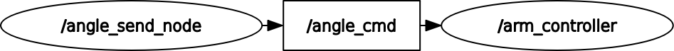

# spina_arm_controll
### Node and Topic

## Setup
```
$ cd ~/ros2_ws/src  #Go to ros workspace
$ git clone https://github.com/iHaruruki/spina_arm_controll.git #clone this package
$ cd ~/ros2_ws
$ colcon build --symlink-install
$ source install/setup.bash
```
## Usage
```
$ sudo chmod 777 /dev/ttyUSB0
$ ros2 run spina_arm_controll serial_controller_node
```
### Sending angle command with command line interface tools
```
# Set the overall angle to -90°
$ ros2 topic pub /angle_cmd std_msgs/msg/String "{ data: 'A0p-090' }" --once
# If you want to control a single module, use "{ data: 'C1p+015' }".
$ ros2 topic pub /angle_cmd std_msgs/msg/String "{ data: 'C1p-030' }" --once
```
#### Details of sending angle command
Overall Control
* A: 全体制御
* 0: サブプレースホルダ
* p: 姿勢の軸設定(p:Pitch, r:Yaw)
* -090: -90度<br>

Module Individual Control
* C: モジュール制御
* 1: モジュール番号（1-6）
* p: 姿勢の軸設定(p:Pitch, r:Yaw)
* -015: -15度<br>
### Sending angle command with Node
```
$ ros2 run spina_arm_controll angle_send_node
```
## License
## Authors
## References
